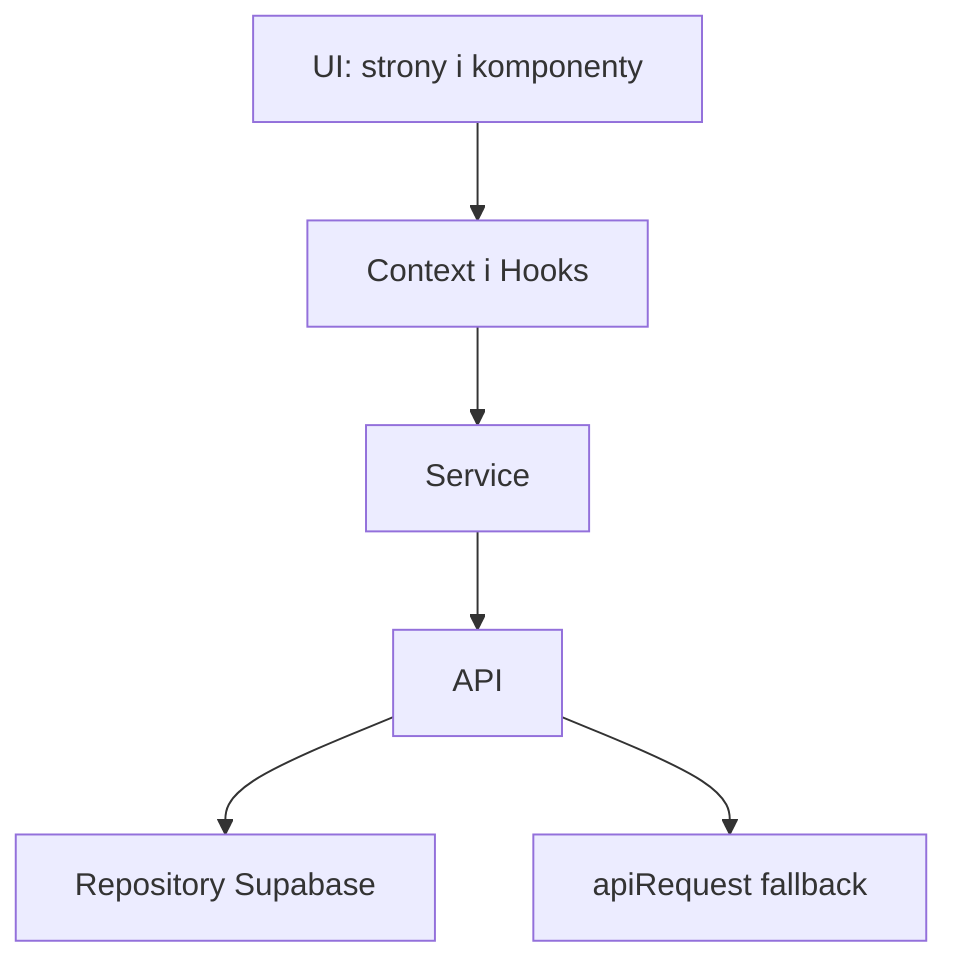

# Architektura aplikacji

Opis warstw danych, obsługi błędów oraz konwencji tras. Szczegóły tabel i mapowanie na widoki: [data-structure.md](data-structure.md).

---

## 1. Architektura warstw

Dane płyną od źródła (Supabase lub backend HTTP) do interfejsu użytkownika przez kolejne warstwy. Każda warstwa korzysta tylko z warstwy poniżej; UI nigdy nie wywołuje API ani repozytoriów bezpośrednio.

### Rola warstw

| Warstwa | Katalog / pliki | Rola |
|---------|-----------------|------|
| **Repository** | `src/lib/supabase/repositories/*.ts` | Bezpośredni dostęp do Supabase (tabele, zapytania). Rzuca błędy zwracane przez backend. Pliki: `content.repository.ts`, `projects.repository.ts`, `contact-message.repository.ts`, `admin-settings.repository.ts`. |
| **API** | `src/lib/api/*.ts` | Wybór źródła danych: jeśli Supabase jest skonfigurowany, wywołuje repository; w przeciwnym razie używa `apiRequest` do backendu HTTP. Abstrakcja nad „skąd dane”. Pliki: `content-api.ts`, `projects-api.ts`, `contact-api.ts`, `contact-messages-api.ts`, `page-views-api.ts`, `admin-settings-api.ts`, `storage-api.ts`; `client.ts` – `apiRequest`. |
| **Service** | `src/lib/services/*.ts` | Logika biznesowa (np. czy sekcja about ma treść, filtry projektów). Wywołuje API, nie repository. Pliki: `content-service.ts`, `projects-service.ts`, `contact-service.ts`, `page-views-service.ts`, `admin-settings-service.ts`, `storage-service.ts`, `contact-messages-service.ts`, `dashboard-service.ts`. |
| **Context / Hooks** | `src/contexts/`, `src/hooks/` | Stan aplikacji i wywołania serwisów. Np. `PortfolioContext` używa `contentService`, `projectsService`, `storageService`; hooki i strony wywołują wyłącznie serwisy, nie API. |
| **UI** | `src/pages/`, `src/components/` | Strony i komponenty. Korzystają wyłącznie z Context i hooków (oraz serwisów przez nie). Nie importują ani nie wywołują warstwy API. |

### Przykład przepływu: ładowanie treści

1. `PortfolioContext` w `loadData` wywołuje `contentService.loadContent()`.
2. `content-service.loadContent()` wywołuje `content-api.getContent()`.
3. `content-api.getContent()`: jeśli jest Supabase → `content.repository.getContent()`; w przeciwnym razie `apiRequest('/api/content')`.
4. Dane wracają w górę; Context ustawia stan; komponenty się przerenderowują.

---

## 2. Obsługa błędów

Wszystkie błędy trafiają do jednego kanału. Dzięki temu można je spójnie logować i w przyszłości podpiąć np. Sentry.

### Jeden kanał: reportError

- **Plik:** `src/lib/errors/report-error.ts`
- **Funkcja:** `reportError(error, context?)` – przyjmuje błąd i opcjonalny kontekst (np. `context`, `route`, `userId`). Loguje błąd (obecnie `console.error` z kontekstem) i **zwraca komunikat dla użytkownika** (string). W przyszłości w tym samym miejscu można dodać wysyłkę do Sentry.

### Typy błędów domenowych

Klasy błędów z polem `code` i opcjonalnym `cause` są w `src/lib/errors/app-errors.ts`. Komunikaty dla użytkownika (toast) są mapowane w `report-error.ts` (USER_MESSAGES), nie w klasach.

| Kod | Przeznaczenie |
|-----|----------------|
| CONTENT_SAVE | Zapis treści strony (content) |
| PROJECTS_SAVE | Zapis listy projektów |
| PROJECT_UPDATE, PROJECT_ORDER_SAVE | Aktualizacja projektu / kolejności |
| PROJECT_DELETE, PROJECT_STORAGE_DELETE | Usunięcie projektu lub plików w storage |
| PROJECT_LOAD | Ładowanie pojedynczego projektu |
| DATA_LOAD, DATA_LOAD_TIMEOUT, DATA_MIGRATION | Ładowanie danych w PortfolioContext, timeout, migracje |
| PAGE_VIEWS_LOAD, PAGE_VIEWS_DELETE, PAGE_VIEW_RECORD | Odwiedziny: odczyt, usuwanie, rejestracja wizyty |
| CONTACT_MESSAGES_LOAD, CONTACT_MESSAGE_DELETE | Wiadomości kontaktowe: odczyt, usuwanie |
| CODE_FRAGMENT_LOAD | Ładowanie fragmentu kodu (BlockCodeRenderer / BlockCodeEditor) |
| HTTP_REQUEST | Błąd żądania HTTP (np. z apiRequest) |
| PROFANITY_LIST_LOAD | Błąd wczytywania listy słów (walidacja) |
| APP_INIT, GLOBAL_ERROR, UNHANDLED_REJECTION, ERROR_BOUNDARY | Inicjalizacja aplikacji, błąd globalny, nieobsłużona obietnica, ErrorBoundary |

### Gdzie używać

- W każdym `.catch()` i przy błędach krytycznych: wywołać `reportError(err, { context: '...' })`. Nie połykać błędów pustym `.catch(() => {})`.
- Toast: pokazywać komunikat zwrócony przez `reportError` lub stałą związaną z operacją.
- ErrorBoundary i globalne handlery (np. w `main.tsx`): przekazać błąd do `reportError` z odpowiednim kontekstem (`error_boundary`, `global_error`, `unhandled_rejection`).

---

## 3. Ścieżki (routes)

Stałe tras są w jednym pliku. W kodzie nie używamy literałów typu `'/admin/login'` – tylko import z tego pliku.

### Jedno źródło prawdy

- **Plik:** `src/lib/constants/routes.ts`

Eksportowane stałe:

- `ADMIN_LOGIN` – `/admin/login`
- `ADMIN_DASHBOARD` – `/admin/dashboard`
- `ADMIN_PROJECTS` – `/admin/projects`
- `ADMIN_CONTENT_HOME`, `ADMIN_CONTENT_ABOUT`, `ADMIN_CONTENT_CONTACT` – zakładki treści
- `ADMIN_SETTINGS` – `/admin/settings`
- `adminProject(id)` – funkcja zwracająca ścieżkę do edycji projektu, np. `/admin/projects/1`

### Pełne URL-e (redirecty)

Do budowania pełnego adresu (np. po logowaniu, gdy trzeba przekazać URL do zewnętrznego providera) służy `src/lib/constants/app-url.ts`:

- `getFullUrlForRoute(routePath)` – zwraca pełny URL (origin + base path + ścieżka). Poza przeglądarką zwraca sam path.
- `getRouterBasename()` – wartość basename dla React Router (spójna z Vite BASE_URL).

Nie sklejamy ręcznie `window.location.origin` + `BASE_URL` + ścieżka – łatwo o błąd przy skomplikowanym BASE_URL.

### Gdzie używane

Stałe z `routes.ts` i (gdzie potrzebne) funkcje z `app-url.ts` są używane m.in. w: `App.tsx` (Route, Navigate), `AdminLayout.tsx` (Navigate), `Sidebar.tsx` (linki), `AdminLoginPage.tsx` (redirect po logowaniu), `auth.ts` (redirect po logowaniu), `HomePage.tsx` (link do panelu). W tych miejscach trasy pochodzą wyłącznie z `routes.ts`.
