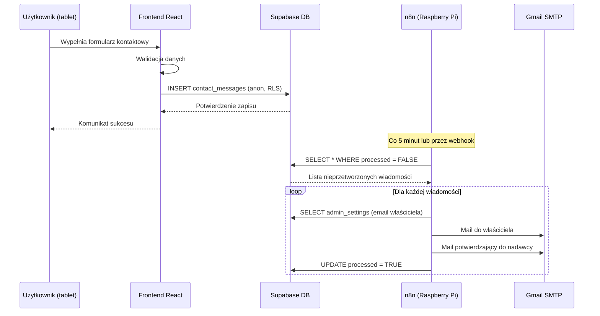

# Plan wdrożenia formularza kontaktowego z Supabase i n8n

## Przegląd rozwiązania

Formularz kontaktowy zapisuje wiadomości do Supabase (anon może tylko INSERT). n8n odczytuje nieprzetworzone wiadomości, wysyła maile (do właściciela i potwierdzenie do nadawcy) oraz oznacza wiadomości jako przetworzone. Ustawienia właściciela (email, nazwa) są przechowywane w osobnej tabeli dostępnej tylko dla zalogowanych użytkowników.

## Architektura przepływu danych



## Etap 1: Migracje SQL w Supabase

### 1.1 Tabela contact_messages

**Plik:** `scripts/supabase/05-contact_messages.sql`

```sql
-- Tabela do przechowywania wiadomości kontaktowych
CREATE TABLE IF NOT EXISTS public.contact_messages (
  id UUID PRIMARY KEY DEFAULT gen_random_uuid(),
  name TEXT NOT NULL,
  email TEXT NOT NULL,
  message TEXT NOT NULL,
  created_at TIMESTAMPTZ DEFAULT NOW() NOT NULL,
  processed BOOLEAN DEFAULT FALSE NOT NULL,
  processed_at TIMESTAMPTZ,
  
  -- Walidacja na poziomie bazy danych
  CONSTRAINT check_name_length CHECK (char_length(name) BETWEEN 2 AND 100),
  CONSTRAINT check_email_format CHECK (email ~* '^[A-Za-z0-9._%+-]+@[A-Za-z0-9.-]+\.[A-Za-z]{2,}$'),
  CONSTRAINT check_message_length CHECK (char_length(message) BETWEEN 10 AND 2000)
);

-- Indeks dla szybkiego wyszukiwania nieprzetworzonych wiadomości
CREATE INDEX IF NOT EXISTS idx_contact_messages_processed 
  ON public.contact_messages(processed, created_at);

-- RLS: włączamy
ALTER TABLE public.contact_messages ENABLE ROW LEVEL SECURITY;

-- Polityka: anon może tylko INSERT (nie może czytać ani modyfikować)
CREATE POLICY "anon_can_insert_contact_messages"
  ON public.contact_messages
  FOR INSERT
  TO anon
  WITH CHECK (true);

-- Polityka: authenticated może czytać wszystkie (dla panelu admina)
CREATE POLICY "authenticated_can_read_contact_messages"
  ON public.contact_messages
  FOR SELECT
  TO authenticated
  USING (true);

-- Polityka: authenticated może aktualizować (dla oznaczenia jako przetworzone)
CREATE POLICY "authenticated_can_update_contact_messages"
  ON public.contact_messages
  FOR UPDATE
  TO authenticated
  USING (true)
  WITH CHECK (true);
```

### 1.2 Tabela admin_settings

**Plik:** `scripts/supabase/06-admin_settings.sql`

```sql
-- Tabela do przechowywania ustawień właściciela (tylko dla zalogowanych)
CREATE TABLE IF NOT EXISTS public.admin_settings (
  id UUID PRIMARY KEY DEFAULT gen_random_uuid(),
  user_id UUID REFERENCES auth.users(id) ON DELETE CASCADE,
  email TEXT NOT NULL,
  name TEXT NOT NULL,
  created_at TIMESTAMPTZ DEFAULT NOW() NOT NULL,
  updated_at TIMESTAMPTZ DEFAULT NOW() NOT NULL,
  
  -- Jeden rekord na użytkownika
  UNIQUE(user_id),
  
  -- Walidacja
  CONSTRAINT check_email_format CHECK (email ~* '^[A-Za-z0-9._%+-]+@[A-Za-z0-9.-]+\.[A-Za-z]{2,}$'),
  CONSTRAINT check_name_length CHECK (char_length(name) BETWEEN 2 AND 100)
);

-- Trigger do automatycznej aktualizacji updated_at
CREATE OR REPLACE FUNCTION update_admin_settings_updated_at()
RETURNS TRIGGER AS $$
BEGIN
  NEW.updated_at = NOW();
  RETURN NEW;
END;
$$ LANGUAGE plpgsql;

CREATE TRIGGER trigger_update_admin_settings_updated_at
  BEFORE UPDATE ON public.admin_settings
  FOR EACH ROW
  EXECUTE FUNCTION update_admin_settings_updated_at();

-- RLS: włączamy
ALTER TABLE public.admin_settings ENABLE ROW LEVEL SECURITY;

-- Polityka: tylko authenticated może czytać swoje ustawienia
CREATE POLICY "authenticated_can_read_own_settings"
  ON public.admin_settings
  FOR SELECT
  TO authenticated
  USING (auth.uid() = user_id);

-- Polityka: tylko authenticated może tworzyć swoje ustawienia
CREATE POLICY "authenticated_can_insert_own_settings"
  ON public.admin_settings
  FOR INSERT
  TO authenticated
  WITH CHECK (auth.uid() = user_id);

-- Polityka: tylko authenticated może aktualizować swoje ustawienia
CREATE POLICY "authenticated_can_update_own_settings"
  ON public.admin_settings
  FOR UPDATE
  TO authenticated
  USING (auth.uid() = user_id)
  WITH CHECK (auth.uid() = user_id);
```

**Uwaga:** n8n będzie potrzebować Service Role Key do odczytu `admin_settings` (nie może używać RLS jako anon/authenticated user).

## Etap 2: Struktura katalogów i plików

### 2.1 Nowe pliki dla contact_messages

```
src/lib/
  types/
    contact-message.ts          # Typy TypeScript dla ContactMessage
  supabase/
    repositories/
      contact-message.repository.ts  # Repository do operacji na contact_messages
  api/
    contact-api.ts             # API do zapisu wiadomości kontaktowych
  validation/
    contact-validation.ts       # Walidacja formularza kontaktowego
  hooks/
    use-contact-form.ts         # Hook React do zarządzania formularzem
```

### 2.2 Nowe pliki dla admin_settings

```
src/lib/
  types/
    admin-settings.ts           # Typy TypeScript dla AdminSettings
  supabase/
    repositories/
      admin-settings.repository.ts  # Repository do operacji na admin_settings
  api/
    admin-settings-api.ts      # API do odczytu/zapisu ustawień
```

### 2.3 Zmiany w istniejących plikach

- `src/components/portfolio/contact-section.tsx` - dodanie logiki formularza
- `src/pages/AdminSettingsPage.tsx` - integracja z admin_settings
- `src/lib/supabase/database.types.ts` - regeneracja typów po migracjach SQL

## Etap 3: Implementacja frontend

### 3.1 Typy TypeScript

**Plik:** `src/lib/types/contact-message.ts`

```typescript
export interface ContactMessage {
  id: string
  name: string
  email: string
  message: string
  created_at: string
  processed: boolean
  processed_at: string | null
}

export interface ContactMessageInsert {
  name: string
  email: string
  message: string
}
```

**Plik:** `src/lib/types/admin-settings.ts`

```typescript
export interface AdminSettings {
  id: string
  user_id: string
  email: string
  name: string
  created_at: string
  updated_at: string
}

export interface AdminSettingsInsert {
  email: string
  name: string
}

export interface AdminSettingsUpdate {
  email?: string
  name?: string
}
```

### 3.2 Repository dla contact_messages

**Plik:** `src/lib/supabase/repositories/contact-message.repository.ts`

Funkcje:
- `insertContactMessage(data: ContactMessageInsert): Promise<ContactMessage>`
- `getUnprocessedMessages(): Promise<ContactMessage[]>` (tylko dla authenticated/admin)
- `markAsProcessed(id: string): Promise<void>` (tylko dla authenticated/admin)

### 3.3 Repository dla admin_settings

**Plik:** `src/lib/supabase/repositories/admin-settings.repository.ts`

Funkcje:
- `getAdminSettings(): Promise<AdminSettings | null>` (tylko authenticated, własne ustawienia)
- `upsertAdminSettings(data: AdminSettingsInsert): Promise<AdminSettings>` (tylko authenticated)
- `getAdminSettingsByUserId(userId: string): Promise<AdminSettings | null>` (dla n8n z service role)

### 3.4 Walidacja formularza

**Plik:** `src/lib/validation/contact-validation.ts`

Funkcje:
- `validateContactForm(name: string, email: string, message: string): { valid: boolean; errors: string[] }`
- Walidacja: długość imienia (2-100), format emaila, długość wiadomości (10-2000)

### 3.5 Hook do formularza

**Plik:** `src/lib/hooks/use-contact-form.ts`

Hook React z:
- Stanem formularza (name, email, message)
- Walidacją
- Funkcją submit (zapis do Supabase)
- Stanem loading/error/success

### 3.6 Komponent ContactSection

**Zmiany w:** `src/components/portfolio/contact-section.tsx`

- Dodanie stanu formularza (useState lub use-contact-form)
- Obsługa onSubmit z walidacją
- Wywołanie API do zapisu w Supabase
- Komunikaty sukcesu/błędu (toast)
- Wyłączenie przycisku podczas wysyłki

### 3.7 Strona ustawień admina

**Zmiany w:** `src/pages/AdminSettingsPage.tsx`

- Ładowanie admin_settings przy mount (tylko gdy zalogowany)
- Formularz do edycji email i name
- Zapis przez API (upsert)
- Komunikaty sukcesu/błędu

## Etap 4: Workflow n8n

### 4.1 Schemat workflow

```
[Trigger: Schedule] (co 5 minut)
  ↓
[Supabase: Execute Query]
  SELECT * FROM contact_messages 
  WHERE processed = FALSE 
  ORDER BY created_at ASC
  LIMIT 10
  ↓
[IF: Czy są nieprzetworzone wiadomości?]
  ↓ TAK
[Split In Batches] (jeśli wiele wiadomości)
  ↓
[Loop: Dla każdej wiadomości]
  ↓
  [Supabase: Execute Query]
    SELECT email, name FROM admin_settings 
    LIMIT 1
    (używa Service Role Key)
    ↓
  [IF: Czy znaleziono email właściciela?]
    ↓ TAK
    [Send Email] (Gmail SMTP)
      From: twoj@gmail.com
      To: {{ $json.email }} (z admin_settings)
      Subject: Portfolio - wiadomość od {{ $json.name }}
      Body: 
        Od: {{ $json.name }} ({{ $json.email }})
        Data: {{ $json.created_at }}
        Wiadomość:
        {{ $json.message }}
      ↓
    [Send Email] (Gmail SMTP - potwierdzenie)
      From: twoj@gmail.com
      To: {{ $json.email }} (z contact_messages)
      Subject: Otrzymaliśmy Twoją wiadomość
      Body:
        Dziękujemy za kontakt! Twoja wiadomość została przekazana.
        Wkrótce się skontaktujemy.
      ↓
    [Supabase: Update]
      UPDATE contact_messages 
      SET processed = TRUE, processed_at = NOW()
      WHERE id = {{ $json.id }}
      ↓
    [Continue on Error] (jeśli błąd, loguj ale kontynuuj)
  ↓ NIE (brak emaila właściciela)
  [Log: Błąd - brak ustawień właściciela]
```

### 4.2 Konfiguracja n8n

**Wymagane credentials w n8n:**

1. **Supabase Connection:**
   - URL: `https://[PROJECT_REF].supabase.co`
   - Service Role Key (nie anon key!) - do odczytu admin_settings i update contact_messages

2. **Gmail SMTP:**
   - Host: `smtp.gmail.com`
   - Port: `465` (SSL) lub `587` (TLS)
   - User: Twój adres Gmail
   - Password: Hasło aplikacji Gmail (nie zwykłe hasło!)

**Uwaga:** Service Role Key w n8n powinien być przechowywany jako secret/credential, nie hardcodowany.

### 4.3 Alternatywa: Supabase Database Webhooks

Zamiast polling (co 5 minut), można użyć Database Webhooks w Supabase:

1. W Supabase Dashboard → Database → Webhooks
2. Utwórz webhook na INSERT do `contact_messages`
3. URL: webhook n8n (np. `https://twoj-n8n/webhook/supabase-contact`)
4. W n8n: Webhook Trigger zamiast Schedule Trigger

**Zalety:** Natychmiastowa reakcja, bez opóźnienia polling.

## Etap 5: Regeneracja typów Supabase

Po wykonaniu migracji SQL:

1. Ustaw `SUPABASE_PROJECT_ID` w `.env`
2. Uruchom: `npm run gen:supabase-types`
3. Sprawdź czy `database.types.ts` zawiera nowe tabele: `contact_messages` i `admin_settings`

## Etap 6: Testowanie

### 6.1 Test formularza kontaktowego

1. Otwórz stronę portfolio (tablet)
2. Przejdź do zakładki Kontakt
3. Wypełnij formularz i wyślij
4. Sprawdź w Supabase Dashboard → Table Editor → `contact_messages` czy rekord się pojawił
5. Sprawdź czy `processed = FALSE`

### 6.2 Test ustawień admina

1. Zaloguj się w panelu admina
2. Przejdź do Ustawienia
3. Wpisz email i nazwę, zapisz
4. Sprawdź w Supabase czy rekord w `admin_settings` został utworzony/zaktualizowany

### 6.3 Test workflow n8n

1. Utwórz testową wiadomość w `contact_messages` (processed = FALSE)
2. Upewnij się że w `admin_settings` jest rekord z Twoim emailem
3. Uruchom workflow n8n ręcznie (Execute Workflow)
4. Sprawdź czy:
   - Otrzymałeś maila z wiadomością
   - Nadawca otrzymał maila potwierdzającego
   - W bazie `processed = TRUE` i `processed_at` jest ustawione

## Etap 7: Bezpieczeństwo - dodatkowe uwagi

### 7.1 Rate limiting (opcjonalnie)

Można dodać w Supabase funkcję sprawdzającą liczbę wiadomości z tego samego emaila w ostatniej godzinie:

```sql
CREATE OR REPLACE FUNCTION check_rate_limit(p_email TEXT)
RETURNS BOOLEAN AS $$
DECLARE
  v_count INTEGER;
BEGIN
  SELECT COUNT(*) INTO v_count
  FROM contact_messages
  WHERE email = p_email
    AND created_at > NOW() - INTERVAL '1 hour';
  
  RETURN v_count < 5; -- max 5 wiadomości na godzinę
END;
$$ LANGUAGE plpgsql SECURITY DEFINER;
```

I użyć w CHECK constraint lub triggerze przed INSERT.

### 7.2 Sanityzacja danych

Supabase automatycznie escapuje wartości przez parametr query, ale warto też:
- Trimować białe znaki w frontendzie przed wysłaniem
- Ograniczyć długość pól (CHECK constraints w bazie)
- Walidować format emaila (CHECK constraint + regex w frontendzie)

## Kolejność wykonania kroków

1. **Krok 1:** Migracje SQL (05-contact_messages.sql, 06-admin_settings.sql)
2. **Krok 2:** Regeneracja typów Supabase (`npm run gen:supabase-types`)
3. **Krok 3:** Utworzenie typów TypeScript (contact-message.ts, admin-settings.ts)
4. **Krok 4:** Implementacja repository (contact-message.repository.ts, admin-settings.repository.ts)
5. **Krok 5:** Implementacja API (contact-api.ts, admin-settings-api.ts)
6. **Krok 6:** Walidacja i hook (contact-validation.ts, use-contact-form.ts)
7. **Krok 7:** Aktualizacja komponentów (contact-section.tsx, AdminSettingsPage.tsx)
8. **Krok 8:** Konfiguracja workflow n8n (schemat + credentials)
9. **Krok 9:** Testowanie end-to-end

## Informacje potrzebne do wykonania w osobnych czatach

### Dla każdego kroku potrzebne będą:

- **Krok 1 (SQL):** Dostęp do Supabase Dashboard → SQL Editor
- **Krok 2 (Typy):** `SUPABASE_PROJECT_ID` w `.env`
- **Krok 3-7 (Kod):** Struktura projektu (już znana), wzorce z istniejących plików (content.repository.ts jako przykład)
- **Krok 8 (n8n):** 
  - Service Role Key z Supabase (Settings → API → service_role key)
  - Hasło aplikacji Gmail (Google Account → Security → App passwords)
  - URL n8n (jeśli używasz tunelu/DDNS)
- **Krok 9 (Testy):** 
  - Dostęp do Supabase Dashboard (Table Editor)
  - Dostęp do n8n (Execute Workflow)
  - Konto Gmail do testów

## Uwagi końcowe

- Wszystkie operacje na `contact_messages` przez anon są tylko INSERT (RLS)
- `admin_settings` jest dostępne tylko dla authenticated użytkownika (własne ustawienia)
- n8n używa Service Role Key do odczytu `admin_settings` i update `contact_messages`
- Workflow n8n może działać na polling (co 5 min) lub przez Database Webhooks (natychmiastowo)
- Wszystkie dane są walidowane zarówno w frontendzie jak i w bazie (CHECK constraints)
