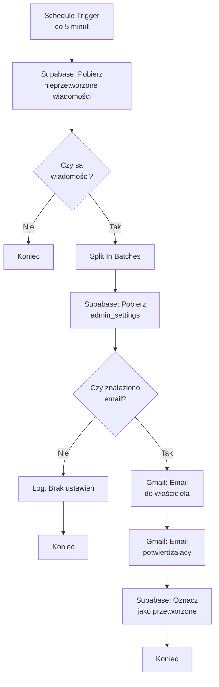

# Dokumentacja workflow n8n - Formularz kontaktowy

Ten katalog zawiera dokumentację i pliki pomocnicze dla workflow n8n, który automatycznie przetwarza wiadomości z formularza kontaktowego.

## Pliki w tym katalogu

### 📄 workflow-contact-form-docs.md
Szczegółowa dokumentacja workflow n8n z instrukcjami krok po kroku:
- Konfiguracja węzłów
- Opcja A: Workflow z Schedule Trigger (polling co 5 minut)
- Opcja B: Workflow z Webhook Trigger (natychmiastowa reakcja)
- Obsługa błędów i logowanie
- Testowanie workflow
- Optymalizacje i ulepszenia

### 🔐 credentials-setup.md
Instrukcje konfiguracji credentials (połączeń) w n8n:
- Konfiguracja Supabase Service Role Key
- Konfiguracja Gmail App Password
- Rozwiązywanie problemów
- Bezpieczeństwo

### 🧪 test-queries.sql
Skrypty SQL do testowania workflow:
- Przygotowanie danych testowych
- Sprawdzanie nieprzetworzonych wiadomości
- Sprawdzanie ustawień właściciela
- Symulacja przetwarzania
- Statystyki i monitoring
- Czyszczenie danych testowych

### 📋 workflow-contact-form.json
Przykładowy eksport workflow z n8n w formacie JSON. Możesz zaimportować ten plik do n8n:
1. Otwórz n8n
2. Kliknij "Import from File"
3. Wybierz ten plik
4. **UWAGA:** Musisz najpierw skonfigurować credentials (zobacz `credentials-setup.md`)

## Szybki start

### 1. Przygotowanie credentials

Przeczytaj i wykonaj instrukcje z [`credentials-setup.md`](credentials-setup.md):
- Skonfiguruj Supabase Service Role Key
- Skonfiguruj Gmail App Password

### 2. Utworzenie workflow

**Opcja A: Import z pliku JSON**
1. Otwórz n8n
2. Kliknij "Import from File"
3. Wybierz `workflow-contact-form.json`
4. Zaktualizuj credentials w każdym węźle

**Opcja B: Utworzenie ręczne**
1. Przeczytaj [`workflow-contact-form-docs.md`](workflow-contact-form-docs.md)
2. Postępuj zgodnie z instrukcjami krok po kroku

### 3. Testowanie

1. Uruchom zapytania z [`test-queries.sql`](test-queries.sql) w Supabase SQL Editor
2. Utwórz testową wiadomość kontaktową
3. Uruchom workflow ręcznie w n8n (Execute Workflow)
4. Sprawdź czy otrzymałeś emaile
5. Sprawdź w Supabase czy wiadomość została oznaczona jako przetworzona

### 4. Aktywacja

1. Włącz workflow w n8n (ustaw jako Active)
2. Workflow będzie uruchamiał się automatycznie co 5 minut (lub zgodnie z konfiguracją)
3. Monitoruj Execution History w n8n

## Architektura

## Wymagania

- n8n zainstalowany i działający (lokalnie lub na Raspberry Pi)
- Konto Supabase z utworzonymi tabelami:
  - `contact_messages` (zobacz `scripts/supabase/06-contact_messages.sql`)
  - `admin_settings` (zobacz `scripts/supabase/07-admin_settings.sql`)
- Konto Gmail z włączoną 2-Step Verification
- Service Role Key z Supabase
- Gmail App Password

## Bezpieczeństwo

⚠️ **WAŻNE:**
- Service Role Key omija Row Level Security - przechowuj go bezpiecznie
- NIE commituj credentials do repozytorium Git
- Używaj App Password zamiast zwykłego hasła Gmail
- Regularnie sprawdzaj Execution History w n8n pod kątem błędów

## Rozwiązywanie problemów

### Workflow nie uruchamia się automatycznie
- Sprawdź czy workflow jest ustawiony jako Active
- Sprawdź konfigurację Schedule Trigger
- Sprawdź logi n8n

### Błąd połączenia z Supabase
- Sprawdź czy Service Role Key jest poprawny
- Sprawdź czy Project URL jest poprawny
- Sprawdź czy tabela istnieje w Supabase

### Błąd wysyłki emaila
- Sprawdź czy używasz App Password (nie zwykłego hasła)
- Sprawdź czy 2-Step Verification jest włączona
- Sprawdź limity Gmail (500 emaili/dzień dla darmowego konta)

### Wiadomości nie są przetwarzane
- Sprawdź czy są nieprzetworzone wiadomości (`processed = FALSE`)
- Sprawdź czy istnieje rekord w `admin_settings`
- Sprawdź logi workflow w n8n

## Monitoring

Regularnie sprawdzaj:
- Execution History w n8n - czy workflow działa poprawnie
- Supabase Table Editor - czy wiadomości są przetwarzane
- Statystyki z `test-queries.sql` - ile wiadomości zostało przetworzonych

## Wsparcie

Jeśli masz problemy:
1. Sprawdź dokumentację w tym katalogu
2. Sprawdź logi w n8n (Execution History)
3. Sprawdź logi w Supabase (Table Editor)
4. Użyj zapytań z `test-queries.sql` do diagnostyki

## Aktualizacje

Ten workflow może być rozszerzony o:
- Rate limiting (ograniczenie liczby wiadomości z jednego emaila)
- Retry mechanism (ponowne próby przy błędach)
- Monitoring i alerty (Slack, Discord)
- Szablony emaili przechowywane w bazie danych
- Dodatkowe pola w `contact_messages` (error_message, retry_count, priority)

Zobacz sekcję "Optymalizacje i ulepszenia" w `workflow-contact-form-docs.md` dla szczegółów.
