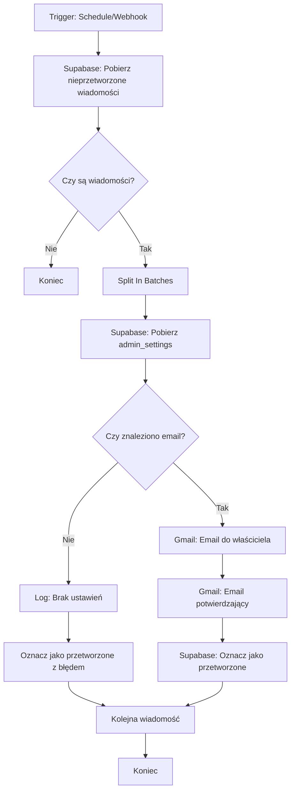

# Dokumentacja workflow n8n - Przetwarzanie formularza kontaktowego

## Przegląd

Workflow n8n automatycznie przetwarza wiadomości kontaktowe z tabeli `contact_messages` w Supabase:
1. Odczytuje nieprzetworzone wiadomości (`processed = FALSE`)
2. Pobiera ustawienia właściciela z `admin_settings`
3. Wysyła email do właściciela z treścią wiadomości
4. Wysyła email potwierdzający do nadawcy
5. Oznacza wiadomość jako przetworzoną (`processed = TRUE`, `processed_at = NOW()`)

## Architektura workflow



## Opcja A: Workflow z Schedule Trigger (Polling co 5 minut)

### Krok 1: Utworzenie nowego workflow

1. Otwórz n8n (lokalnie lub na Raspberry Pi)
2. Kliknij "Add workflow" lub "New workflow"
3. Nadaj nazwę: `Contact Form Processor` lub `Przetwarzanie formularza kontaktowego`

### Krok 2: Konfiguracja Schedule Trigger

**Węzeł:** Schedule Trigger

**Ustawienia:**
- **Trigger Interval:** `Every 5 minutes` (lub `*/5 * * * *` w formacie cron)
- **Timezone:** Wybierz swoją strefę czasową (np. `Europe/Warsaw`)

**Wyjaśnienie:** Ten węzeł uruchamia workflow automatycznie co 5 minut. Jest to proste rozwiązanie, które nie wymaga dodatkowej konfiguracji w Supabase.

**Alternatywne interwały:**
- `Every 1 minute` - częstsze sprawdzanie (większe obciążenie)
- `Every 10 minutes` - rzadsze sprawdzanie (mniejsze obciążenie, większe opóźnienie)
- `Every hour` - tylko dla małej liczby wiadomości

### Krok 3: Pobranie nieprzetworzonych wiadomości z Supabase

**Węzeł:** Supabase (Execute Query)

**Nazwa węzła:** `Get Unprocessed Messages`

**Konfiguracja połączenia Supabase:**
- **Connection Type:** `Service Account` (używa Service Role Key)
- **Project URL:** `https://[PROJECT_REF].supabase.co`
- **Service Role Key:** Wklej Service Role Key z Supabase Dashboard → Settings → API

**Query SQL:**
```sql
SELECT 
  id,
  name,
  email,
  message,
  created_at,
  processed,
  processed_at
FROM public.contact_messages
WHERE processed = FALSE
ORDER BY created_at ASC
LIMIT 10
```

**Uwagi:**
- `LIMIT 10` - przetwarzamy maksymalnie 10 wiadomości na raz (można zwiększyć)
- `ORDER BY created_at ASC` - najstarsze wiadomości najpierw (FIFO)
- Używamy Service Role Key, aby ominąć RLS i móc odczytać wszystkie wiadomości

**Output:** Tablica obiektów z wiadomościami (lub pusta tablica, jeśli brak nieprzetworzonych)

### Krok 4: Sprawdzenie czy są wiadomości do przetworzenia

**Węzeł:** IF

**Nazwa węzła:** `Check If Messages Exist`

**Warunek:**
- **Condition:** `Array`
- **Value 1:** `{{ $json.length }}` lub `{{ $input.all().length }}`
- **Operation:** `Is Not Empty` lub `Greater Than`
- **Value 2:** `0`

**Wyjaśnienie:** Sprawdzamy czy zapytanie zwróciło jakiekolwiek wiadomości. Jeśli nie, workflow kończy działanie.

**Ścieżka TAK:** Przejdź do przetwarzania wiadomości
**Ścieżka NIE:** Zakończ workflow (można dodać węzeł "No Operation" lub po prostu nie łączyć dalej)

### Krok 5: Podział na pojedyncze wiadomości

**Węzeł:** Split In Batches

**Nazwa węzła:** `Split Messages`

**Ustawienia:**
- **Batch Size:** `1` (przetwarzamy pojedynczo)
- **Options → Reset:** `false` (nie resetuj między uruchomieniami)

**Wyjaśnienie:** Ten węzeł przekształca tablicę wiadomości w pojedyncze elementy, które będą przetwarzane w pętli.

**Alternatywa:** Można użyć węzła "Loop Over Items" jeśli n8n ma taką funkcjonalność.

### Krok 6: Pobranie ustawień właściciela

**Węzeł:** Supabase (Execute Query)

**Nazwa węzła:** `Get Owner Settings`

**Query SQL:**
```sql
SELECT 
  email,
  name
FROM public.admin_settings
LIMIT 1
```

**Uwagi:**
- Używamy Service Role Key (ten sam co wcześniej)
- `LIMIT 1` - zakładamy, że jest tylko jeden właściciel
- Jeśli będzie więcej użytkowników, można dodać `ORDER BY updated_at DESC` aby wziąć najnowsze

**Output:** Obiekt z `email` i `name` właściciela (lub pusty wynik)

**Przechowywanie danych:** Wynik będzie dostępny jako `$json.email` i `$json.name` w kolejnych węzłach.

### Krok 7: Sprawdzenie czy znaleziono email właściciela

**Węzeł:** IF

**Nazwa węzeł:** `Check Owner Email`

**Warunek:**
- **Condition:** `String`
- **Value 1:** `{{ $json.email }}`
- **Operation:** `Is Not Empty` lub `Exists`

**Wyjaśnienie:** Sprawdzamy czy udało się pobrać email właściciela. Jeśli nie, nie możemy wysłać maila i oznaczamy wiadomość jako przetworzoną z błędem.

**Ścieżka TAK:** Przejdź do wysyłki maili
**Ścieżka NIE:** Przejdź do logowania błędu

### Krok 8: Wysłanie emaila do właściciela

**Węzeł:** Gmail (Send Email) lub SMTP (Send Email)

**Nazwa węzła:** `Send Email To Owner`

**Konfiguracja połączenia Gmail/SMTP:**

**Opcja A - Gmail (natywny węzeł n8n):**
- **Authentication:** `OAuth2` (wymaga konfiguracji OAuth) lub `App Password`
- **Email:** Twój adres Gmail
- **App Password:** Hasło aplikacji Gmail (nie zwykłe hasło!)

**Opcja B - SMTP (uniwersalne):**
- **Host:** `smtp.gmail.com`
- **Port:** `465` (SSL) lub `587` (TLS)
- **User:** Twój adres Gmail
- **Password:** Hasło aplikacji Gmail
- **Secure:** `true` (SSL/TLS)

**Treść emaila:**

**To (Odbiorca):**
```
{{ $('Get Owner Settings').item.json.email }}
```

**From (Nadawca):**
```
twoj@gmail.com
```

**Subject (Temat):**
```
Portfolio - Nowa wiadomość od {{ $('Split Messages').item.json.name }}
```

**Body (Treść - HTML):**
```html
<h2>Nowa wiadomość z formularza kontaktowego</h2>
<p><strong>Od:</strong> {{ $('Split Messages').item.json.name }} ({{ $('Split Messages').item.json.email }})</p>
<p><strong>Data:</strong> {{ $('Split Messages').item.json.created_at }}</p>
<hr>
<p><strong>Wiadomość:</strong></p>
<p>{{ $('Split Messages').item.json.message }}</p>
```

**Body (Treść - Plain Text):**
```
Nowa wiadomość z formularza kontaktowego

Od: {{ $('Split Messages').item.json.name }} ({{ $('Split Messages').item.json.email }})
Data: {{ $('Split Messages').item.json.created_at }}

Wiadomość:
{{ $('Split Messages').item.json.message }}
```

**Wyjaśnienie:** 
- `$('Get Owner Settings')` - odwołanie do węzła z ustawieniami właściciela
- `$('Split Messages')` - odwołanie do węzła z wiadomością
- W n8n można też użyć `$json` jeśli dane są w aktualnym kontekście

### Krok 9: Wysłanie emaila potwierdzającego do nadawcy

**Węzeł:** Gmail (Send Email) lub SMTP (Send Email)

**Nazwa węzła:** `Send Confirmation Email`

**Konfiguracja:** Ta sama co w Kroku 8 (można użyć tego samego połączenia)

**Treść emaila:**

**To (Odbiorca):**
```
{{ $('Split Messages').item.json.email }}
```

**From (Nadawca):**
```
twoj@gmail.com
```

**Subject (Temat):**
```
Otrzymaliśmy Twoją wiadomość - Portfolio
```

**Body (Treść - HTML):**
```html
<h2>Dziękujemy za kontakt!</h2>
<p>Witaj {{ $('Split Messages').item.json.name }},</p>
<p>Otrzymaliśmy Twoją wiadomość i wkrótce się skontaktujemy.</p>
<p>Twoja wiadomość:</p>
<blockquote>{{ $('Split Messages').item.json.message }}</blockquote>
<p>Pozdrawiamy,<br>Zespół Portfolio</p>
```

**Body (Treść - Plain Text):**
```
Dziękujemy za kontakt!

Witaj {{ $('Split Messages').item.json.name }},

Otrzymaliśmy Twoją wiadomość i wkrótce się skontaktujemy.

Twoja wiadomość:
{{ $('Split Messages').item.json.message }}

Pozdrawiamy,
Zespół Portfolio
```

### Krok 10: Oznaczenie wiadomości jako przetworzonej

**Węzeł:** Supabase (Update)

**Nazwa węzła:** `Mark As Processed`

**Konfiguracja:**
- **Connection:** Ten sam co wcześniej (Service Role Key)
- **Table:** `contact_messages`
- **Update Key:** `id`
- **Update Key Value:** `{{ $('Split Messages').item.json.id }}`

**Fields to Update:**
```json
{
  "processed": true,
  "processed_at": "{{ $now }}"
}
```

**Wyjaśnienie:** 
- `$now` - aktualna data i czas w formacie ISO
- Można też użyć `NOW()` w SQL, ale Update węzeł może nie obsługiwać funkcji SQL

**Alternatywa - Execute Query:**
Jeśli Update węzeł nie działa poprawnie, użyj Execute Query:
```sql
UPDATE public.contact_messages
SET processed = TRUE, processed_at = NOW()
WHERE id = '{{ $('Split Messages').item.json.id }}'
```

### Krok 11: Obsługa błędów - brak emaila właściciela

**Węzeł:** Set (lub Code)

**Nazwa węzła:** `Log Missing Owner Email`

**Akcja:** Ustawienie wartości do logowania lub zapisanie do pliku

**Możliwe opcje:**
1. **Log węzeł:** Dodaj węzeł "Log" z komunikatem błędu
2. **Webhook:** Wyślij powiadomienie do zewnętrznego serwisu (np. Slack, Discord)
3. **Email:** Wyślij alert do siebie o braku konfiguracji
4. **Zapis do pliku:** Zapisz informację o błędzie do pliku na Raspberry Pi

**Przykład - Log:**
```
Błąd: Brak ustawień właściciela w admin_settings. Wiadomość ID: {{ $('Split Messages').item.json.id }} nie została przetworzona.
```

**Następnie:** Oznacz wiadomość jako przetworzoną z błędem (można dodać pole `error_message` w przyszłości)

### Krok 12: Obsługa błędów - Continue on Error

**Węzeł:** Continue on Error (opcjonalnie)

**Umieść ten węzeł po:**
- `Send Email To Owner`
- `Send Confirmation Email`
- `Mark As Processed`

**Wyjaśnienie:** Jeśli wysyłka maila lub aktualizacja bazy się nie powiedzie, workflow nie przerwie się całkowicie, ale przejdzie do następnej wiadomości. Błąd zostanie zalogowany.

**Alternatywa:** Można użyć węzła "Error Trigger" do przechwycenia błędów i ich obsługi.

## Opcja B: Workflow z Webhook Trigger (Natychmiastowa reakcja)

### Zalety webhook vs polling:
- **Natychmiastowa reakcja** - wiadomość przetwarzana od razu po wysłaniu
- **Mniejsze obciążenie** - brak ciągłego sprawdzania co 5 minut
- **Bardziej efektywne** - przetwarzanie tylko gdy jest potrzeba

### Krok 1: Konfiguracja Database Webhook w Supabase

1. Otwórz Supabase Dashboard → Database → Webhooks
2. Kliknij "Create a new webhook"
3. **Ustawienia:**
   - **Name:** `contact_message_insert`
   - **Table:** `contact_messages`
   - **Events:** Wybierz `INSERT`
   - **HTTP Request:**
     - **URL:** `https://twoj-n8n-instance.com/webhook/contact-message` (lub lokalny URL jeśli tunel)
     - **HTTP Method:** `POST`
     - **HTTP Headers:** (opcjonalnie) Dodaj nagłówek autoryzacyjny jeśli n8n wymaga

4. Zapisz webhook

### Krok 2: Konfiguracja Webhook Trigger w n8n

**Węzeł:** Webhook

**Nazwa węzła:** `Contact Message Webhook`

**Ustawienia:**
- **HTTP Method:** `POST`
- **Path:** `/contact-message` (lub inna ścieżka)
- **Response Mode:** `Response Node` (n8n zwróci odpowiedź do Supabase)

**Output:** n8n otrzyma dane z Supabase w formacie:
```json
{
  "type": "INSERT",
  "table": "contact_messages",
  "record": {
    "id": "uuid",
    "name": "...",
    "email": "...",
    "message": "...",
    "created_at": "...",
    "processed": false,
    "processed_at": null
  }
}
```

### Krok 3: Przetwarzanie pojedynczej wiadomości

Zamiast pobierania wielu wiadomości, webhook otrzymuje jedną wiadomość na raz. Workflow będzie prostszy:

1. **Webhook Trigger** → otrzymuje wiadomość
2. **Extract record** → wyciągnij `record` z payloadu Supabase
3. **Get Owner Settings** → pobierz ustawienia (jak w Opcji A)
4. **Check Owner Email** → sprawdź czy email istnieje
5. **Send Email To Owner** → wyślij maila
6. **Send Confirmation Email** → wyślij potwierdzenie
7. **Mark As Processed** → oznacz jako przetworzone

**Uwaga:** Nie potrzebujesz "Split In Batches" ani "Loop", bo przetwarzasz jedną wiadomość na raz.

### Krok 4: Response Node

**Węzeł:** Respond to Webhook

**Nazwa węzła:** `Send Response`

**Response Code:** `200`
**Response Body:** (opcjonalnie)
```json
{
  "success": true,
  "message": "Contact message processed"
}
```

**Wyjaśnienie:** Supabase oczekuje odpowiedzi HTTP 200, aby potwierdzić że webhook został obsłużony.

## Obsługa błędów i logowanie

### Strategia obsługi błędów

1. **Brak wiadomości do przetworzenia:**
   - Workflow kończy się normalnie (nie jest to błąd)

2. **Brak ustawień właściciela:**
   - Loguj błąd
   - Oznacz wiadomość jako przetworzoną (aby nie blokować kolejnych)
   - Opcjonalnie: Wyślij alert email do siebie

3. **Błąd wysyłki emaila:**
   - Użyj "Continue on Error" aby nie przerwać workflow
   - Loguj szczegóły błędu
   - Opcjonalnie: Retry mechanism (ponów próbę po X minutach)

4. **Błąd połączenia z Supabase:**
   - Loguj błąd
   - Opcjonalnie: Wyślij alert
   - Workflow zakończy się błędem (można dodać retry)

### Węzły do logowania

**Węzeł:** Log

**Użyj w następujących miejscach:**
- Po `Check If Messages Exist` (TAK) - loguj liczbę wiadomości
- Po `Check Owner Email` (NIE) - loguj brak ustawień
- Po `Send Email To Owner` - loguj sukces/błąd
- Po `Mark As Processed` - loguj zakończenie przetwarzania

**Przykład logu:**
```
[INFO] Przetwarzanie wiadomości: {{ $('Split Messages').item.json.id }}
[INFO] Email właściciela: {{ $('Get Owner Settings').item.json.email }}
[SUCCESS] Email wysłany do właściciela
[SUCCESS] Email potwierdzający wysłany do: {{ $('Split Messages').item.json.email }}
[SUCCESS] Wiadomość oznaczona jako przetworzona
```

## Testowanie workflow

Zobacz plik `test-queries.sql` dla przykładowych zapytań SQL do testowania.

### Test 1: Test podstawowej funkcjonalności

1. **Przygotowanie:**
   - Upewnij się że w `admin_settings` jest rekord z Twoim emailem
   - Utwórz testową wiadomość w `contact_messages` (zobacz `test-queries.sql`)

2. **Uruchomienie:**
   - W n8n: Kliknij "Execute Workflow" (ręczne uruchomienie)
   - Sprawdź logi każdego węzła

3. **Weryfikacja:**
   - Sprawdź czy otrzymałeś email z wiadomością
   - Sprawdź czy `test@example.com` otrzymał email potwierdzający (jeśli używasz prawdziwego adresu)
   - Sprawdź w Supabase czy `processed = TRUE` i `processed_at` jest ustawione

### Test 2: Test z wieloma wiadomościami

1. **Przygotowanie:**
   - Utwórz 3-5 testowych wiadomości (`processed = FALSE`)

2. **Uruchomienie:**
   - Uruchom workflow ręcznie

3. **Weryfikacja:**
   - Sprawdź czy wszystkie wiadomości zostały przetworzone
   - Sprawdź czy otrzymałeś tyle emaili ile było wiadomości
   - Sprawdź czy wszystkie mają `processed = TRUE`

### Test 3: Test obsługi błędów - brak ustawień

1. **Przygotowanie:**
   - Usuń lub zmień rekord w `admin_settings` (ustaw nieprawidłowy email)

2. **Uruchomienie:**
   - Utwórz testową wiadomość
   - Uruchom workflow

3. **Weryfikacja:**
   - Sprawdź czy błąd został zalogowany
   - Sprawdź czy wiadomość została oznaczona jako przetworzona (aby nie blokować kolejnych)

### Test 4: Test webhook (jeśli używasz Opcji B)

1. **Przygotowanie:**
   - Skonfiguruj webhook w Supabase
   - Upewnij się że n8n jest dostępny pod URL webhooka

2. **Uruchomienie:**
   - Wyślij wiadomość przez formularz kontaktowy na stronie
   - Lub wstaw ręcznie w Supabase

3. **Weryfikacja:**
   - Sprawdź czy workflow uruchomił się automatycznie
   - Sprawdź logi w n8n
   - Sprawdź czy email został wysłany

### Test 5: Test automatycznego uruchamiania (Schedule)

1. **Przygotowanie:**
   - Włącz workflow w n8n (ustaw jako Active)
   - Utwórz testową wiadomość

2. **Oczekiwanie:**
   - Poczekaj maksymalnie 5 minut (lub Twój interwał)

3. **Weryfikacja:**
   - Sprawdź czy workflow uruchomił się automatycznie
   - Sprawdź Execution History w n8n
   - Sprawdź czy wiadomość została przetworzona

## Optymalizacje i ulepszenia

### 1. Rate limiting

Aby uniknąć spamowania, można dodać sprawdzanie czy z tego samego emaila nie było zbyt wielu wiadomości w ostatnim czasie:

**W Supabase - funkcja SQL:**
```sql
CREATE OR REPLACE FUNCTION check_rate_limit(p_email TEXT)
RETURNS BOOLEAN AS $$
DECLARE
  v_count INTEGER;
BEGIN
  SELECT COUNT(*) INTO v_count
  FROM contact_messages
  WHERE email = p_email
    AND created_at > NOW() - INTERVAL '1 hour';
  
  RETURN v_count < 5; -- max 5 wiadomości na godzinę
END;
$$ LANGUAGE plpgsql SECURITY DEFINER;
```

**W n8n:** Dodaj węzeł Execute Query przed przetwarzaniem, który sprawdzi rate limit.

### 2. Retry mechanism

Jeśli wysyłka emaila się nie powiedzie, można dodać ponowienie próby:

1. Dodaj węzeł "Wait" po błędzie (np. 5 minut)
2. Spróbuj ponownie wysłać email
3. Maksymalnie 3 próby

### 3. Monitoring i alerty

- Dodaj webhook do Slack/Discord z powiadomieniami o błędach
- Monitoruj liczbę nieprzetworzonych wiadomości (alert jeśli > 10)
- Loguj statystyki (ile wiadomości przetworzono dziennie)

### 4. Szablony emaili

Zamiast hardcodować treść emaila w workflow, można:
- Przechowywać szablony w `admin_settings` (dodatkowe pola)
- Lub użyć Code węzła do generowania HTML z szablonu

### 5. Dodatkowe pola w contact_messages

W przyszłości można dodać:
- `error_message` - zapis błędów przetwarzania
- `retry_count` - liczba ponownych prób
- `priority` - priorytet wiadomości

## Checklist wdrożenia

- [ ] Utworzenie workflow w n8n
- [ ] Konfiguracja Schedule Trigger (lub Webhook)
- [ ] Dodanie credentials Supabase (Service Role Key)
- [ ] Dodanie credentials Gmail (App Password)
- [ ] Konfiguracja węzła pobierania wiadomości
- [ ] Konfiguracja węzła pobierania ustawień właściciela
- [ ] Konfiguracja węzła wysyłki emaila do właściciela
- [ ] Konfiguracja węzła wysyłki emaila potwierdzającego
- [ ] Konfiguracja węzła oznaczenia jako przetworzone
- [ ] Dodanie obsługi błędów (IF, Log, Continue on Error)
- [ ] Test podstawowej funkcjonalności
- [ ] Test z wieloma wiadomościami
- [ ] Test obsługi błędów
- [ ] Włączenie workflow (ustaw jako Active)
- [ ] Monitoring pierwszych uruchomień

## Uwagi końcowe

- **Bezpieczeństwo:** Service Role Key omija RLS - przechowuj go bezpiecznie
- **Koszty:** Gmail ma limity wysyłki (500 emaili/dzień dla darmowego konta)
- **Backup:** Rozważ backup workflow w n8n (eksport JSON)
- **Wersjonowanie:** Jeśli zmieniasz workflow, zapisz wersję w komentarzu
- **Monitoring:** Regularnie sprawdzaj Execution History w n8n
