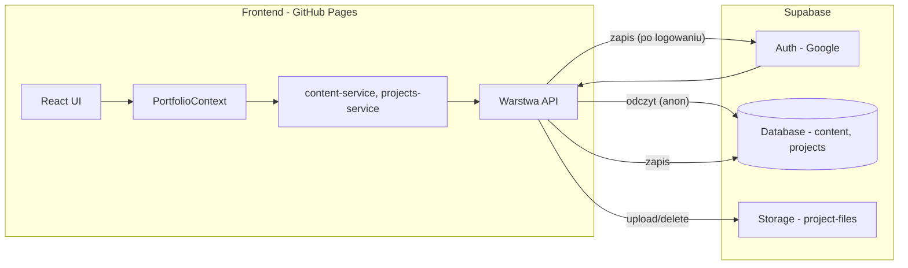

# Plan integracji Supabase z portfolio (GitHub Pages)

Jeden plik z pełnym planem i instrukcjami wdrożenia. W kolejnych czatach możesz podać np.: „Wdróż [Etap 4](docs/plan-integracja-supabase.md#etap-4)” z linkiem do tego pliku.

---

## Obecny stan

- **Dane:** `content.json` (ContentData) i `projects.json` (tablica Project) – odczyt/zapis przez Express (`/api/content`, `/api/projects`).
- **Pliki:** Express + Multer zapisuje w katalogu `storage/projects/{id}/`; ścieżki w JSON to np. `storage/projects/2/plik.ipynb`. Dozwolone: `.pdf`, `.ipynb`, `.md`, `.py`, `.png`, `.jpg`, `.jpeg`, `.webp`.
- **Frontend:** [src/lib/api/client.ts](src/lib/api/client.ts) – `VITE_API_URL`; przy braku API używany jest fallback: sessionStorage + domyślne JSON z repozytorium.
- **Admin:** [AdminLoginPage](src/pages/AdminLoginPage.tsx) – obecnie tylko nawigacja do `/admin/dashboard`, bez prawdziwej autentykacji.

Na **GitHub Pages** nie ma serwera: trzeba odpytywać i zapisywać dane oraz pliki **bezpośrednio z przeglądarki** do Supabase (Database + Storage), z autentykacją przy zapisie.

---

## Docelowa architektura



- **Odczyt:** anonimowy (klucz `anon`) – każdy użytkownik strony widzi content i projekty.
- **Zapis (content, projects, pliki):** tylko zalogowany użytkownik (Supabase Auth + RLS).

---

## Struktura katalogów i plików

Zachowujemy podział: **API** (wywołania zewnętrzne) → **serwisy** (logika ładowania/zapisu, fallback) → **kontekst**.

```
src/lib/
  supabase/
    client.ts           # createClient(SUPABASE_URL, SUPABASE_ANON_KEY)
    types.ts            # (opcjonalnie) typy wygenerowane z DB
  api/
    client.ts           # pozostaje – używany tylko gdy VITE_API_URL (lokalny serwer)
    content-api.ts      # rozszerzenie: getContent/saveContent z Supabase gdy włączone
    projects-api.ts     # rozszerzenie: getProjects/saveProjects z Supabase
    storage-api.ts      # rozszerzenie: upload/delete przez Supabase Storage
  services/
    content-service.ts  # bez zmian w sygnaturach; wewnętrznie wybór API vs Supabase
    projects-service.ts # j.w.
  data/
    store.ts            # fallback sessionStorage – bez zmian
```

**Logika wyboru źródła:** Obecność `VITE_SUPABASE_URL` (i `VITE_SUPABASE_ANON_KEY`) przełącza serwisy na Supabase. Gdy tych zmiennych brak – aplikacja używa Expressa (lub fallback sessionStorage). Klient Supabase w [src/lib/supabase/client.ts](src/lib/supabase/client.ts) czyta wyłącznie z `import.meta.env.VITE_SUPABASE_URL` oraz `import.meta.env.VITE_SUPABASE_ANON_KEY`.

---

## Spis treści – linki do etapów

| Etap | Opis | Link |
|------|------|------|
| 1 | Konfiguracja Supabase i Google (wykonane w dashboardzie) | [Etap 1](#etap-1-konfiguracja-supabase-i-google) |
| 2 | Klient Supabase w aplikacji | [Etap 2](#etap-2-klient-supabase-w-aplikacji) |
| 3 | API: content i projects z Supabase | [Etap 3](#etap-3-api-content-i-projects-z-supabase) |
| 4 | Auth: logowanie Google i ekran logowania | [Etap 4](#etap-4-auth-logowanie-google-i-ekran-logowania) |
| 5 | Storage API: upload/delete plików | [Etap 5](#etap-5-storage-api-upload-i-usuwanie-plików) |
| 6 | URL-e do plików z Supabase | [Etap 6](#etap-6-urle-do-plików-z-supabase) |
| 7 | Serwisy i kontekst + błąd połączenia | [Etap 7](#etap-7-serwisy-kontekst-i-błąd-połączenia) |
| 8 | Komunikat „Brak Danych” na tablecie | [Etap 8](#etap-8-komunikat-brak-danych-na-tablecie) |
| 9 | Czyszczenie i deploy (GitHub Secrets) | [Etap 9](#etap-9-czyszczenie-i-deploy) |

**Tabela etapów – zakres i efekt:**

| Etap | Zakres | Efekt |
|------|--------|--------|
| **1** | Konfiguracja Supabase: projekt, tabele (app_data), RLS, bucket project-files, polityki Storage | Baza i Storage gotowe; dane można ręcznie wstawić w SQL/UI |
| **2** | Frontend: `@supabase/supabase-js`, `src/lib/supabase/client.ts`, zmienne `VITE_SUPABASE_URL`, `VITE_SUPABASE_ANON_KEY` | Klient Supabase w aplikacji |
| **3** | Warstwa API: content-api i projects-api z gałęzią Supabase (get/save), bez usuwania starej ścieżki Express | Odczyt i zapis content/projects z/do Supabase przy włączonej zmiennej |
| **4** | Auth: moduł auth (signInWithOAuth, signOut, onAuthStateChange); dostosowanie i podłączenie ekranu logowania – przycisk wywołuje signInWithOAuth z redirectTo (BASE_URL); stany ładowania i błędów z redirectu; AdminLayout – ochrona tras i przekierowanie po sesji; obsługa powrotu z OAuth | Ekran logowania działa z Google; tylko zalogowany admin wchodzi do panelu |
| **5** | Storage API: upload/delete/init w storage-api przez Supabase Storage; ścieżki w JSON jak `projects/{id}/...` | Załączniki i screeny zapisywane w Supabase Storage |
| **6** | storage-url.ts: dla Supabase zwracać public URL z bucketa | Poprawne wyświetlanie plików na stronie i w panelu |
| **7** | Serwisy i kontekst: przełączenie na Supabase gdy zmienne env ustawione; fallback sessionStorage; przy błędzie połączenia z bazą ustawiać `error` w kontekście | Kontekst sygnalizuje brak połączenia |
| **8** | HomePage: gdy `!loading && error` – wewnątrz tabletu wyświetlać tylko komunikat „Brak Danych, nie połączono z bazą” zamiast zakładek i sekcji | Użytkownik widzi komunikat na tablecie przy braku połączenia z bazą |
| **9** | Czyszczenie: opcjonalnie wyłączenie wywołań do Express; plik `.env.example`; w workflow GitHub przekazanie Secrets jako env do builda | Projekt gotowy: lokalnie z .env, GitHub Pages z Secrets |

---

## Kontekst i architektura

- **Obecny stan:** Dane w `content.json` i `projects.json` przez Express (`/api/content`, `/api/projects`); pliki w `storage/projects/{id}/`. Admin bez prawdziwej autentykacji.
- **Docelowo:** Na GitHub Pages brak serwera – odczyt/zapis z przeglądarki do Supabase (Database + Storage), zapis tylko po zalogowaniu Google.
- **Źródło danych:** Obecność `VITE_SUPABASE_URL` i `VITE_SUPABASE_ANON_KEY` przełącza aplikację na Supabase; brak – Express lub fallback sessionStorage.

Struktura kodu: **API** (content-api, projects-api, storage-api) → **serwisy** (content-service, projects-service) → **PortfolioContext**. Klient Supabase w `src/lib/supabase/client.ts`.

---

## Konfiguracja zmiennych środowiskowych

Dane do połączenia z Supabase muszą być dostępne w buildzie Vite jako zmienne `VITE_*` (wbudowane w kod przy `vite build`).

### Wersja lokalna (development)

- **Plik `.env`** w katalogu głównym projektu (nie trafia do repozytorium – musi być w `.gitignore`).

Przykładowa zawartość:

```
VITE_SUPABASE_URL=https://twoj-projekt.supabase.co
VITE_SUPABASE_ANON_KEY=eyJhbGciOiJIUzI1NiIsInR5cCI6IkpXVCJ9...
```

- **Plik `.env.example`** (można commitować): te same nazwy zmiennych bez wartości:

```
VITE_SUPABASE_URL=
VITE_SUPABASE_ANON_KEY=
```

Przy `npm run dev` Vite wczytuje `.env` i udostępnia zmienne przez `import.meta.env.VITE_SUPABASE_URL` itd.

### GitHub Pages (produkcja)

- W repozytorium: **Settings → Secrets and variables → Actions**.
- Dodaj **Secrets:** `VITE_SUPABASE_URL`, `VITE_SUPABASE_ANON_KEY`.

W workflow budującym stronę w jobie budującym aplikację przekaż sekrety:

```yaml
env:
  VITE_SUPABASE_URL: ${{ secrets.VITE_SUPABASE_URL }}
  VITE_SUPABASE_ANON_KEY: ${{ secrets.VITE_SUPABASE_ANON_KEY }}
```

---

## Baza Supabase – co będzie potrzebne (referencja)

| Informacja | Gdzie | Użycie |
|------------|--------|--------|
| **Project URL** | Project Settings → API | `VITE_SUPABASE_URL` |
| **anon public key** | Project Settings → API | `VITE_SUPABASE_ANON_KEY` |
| **Google Client ID** | Google Cloud Console → Credentials | Supabase Auth → Providers → Google |
| **Google Client Secret** | j.w. | j.w. |
| **Redirect URL Supabase** | Supabase Auth → URL Configuration | Wpis w Google „Authorized redirect URIs” |

Dla **GitHub Pages** w Supabase (Auth → URL Configuration) ustaw:

- **Site URL:** `https://<user>.github.io/Portfolio_mw/` (zgodnie z `base` w [vite.config.ts](vite.config.ts)).
- **Redirect URLs:** `https://<user>.github.io/Portfolio_mw/**`, `http://localhost:5173/**` (developement).

W Google OAuth dodaj w „Authorized JavaScript origins” i „Authorized redirect URIs” odpowiednio origin i redirect URL zwrócony przez Supabase (Auth → Providers → Google).

---

## Pliki – mapowanie na Supabase Storage

- **Obecnie:** ścieżki w JSON to np. `storage/projects/2/file.ipynb`; serwer serwuje z `/storage`.
- **Docelowo:** w JSON trzymamy np. `projects/2/file.ipynb` (względem bucketa). URL do wyświetlenia: `supabase.storage.from('project-files').getPublicUrl(path)` – użycie w [storage-url.ts](src/lib/utils/storage-url.ts).
- **Struktura ścieżek w bucketcie:** `projects/{project_id}/{nazwa_pliku}` (ew. podkatalogi `images/`, `attachments/`, `code/` – zgodnie z [storage-paths.ts](src/lib/constants/storage-paths.ts)).
- Dozwolone rozszerzenia i limity (np. 20 MB) zostają; walidacja po stronie klienta w obecnym miejscu.

Adres pliku po utworzeniu bucketa `project-files` (public):  
`https://<project_ref>.supabase.co/storage/v1/object/public/project-files/<ścieżka>`.

---

## Etap 1: Konfiguracja Supabase i Google

**Status:** Wykonywany w dashboardzie (Supabase + Google Cloud). Zakładamy, że jest już zrobiony.

**Checklist:**

- Projekt Supabase utworzony; tabela `app_data` (key text, value jsonb, updated_at) + RLS (select: anon/authenticated, insert/update/delete: authenticated).
- Bucket `project-files` (public) + polityki Storage (select public, insert/delete authenticated).
- Auth → Providers → Google: włączony, Client ID i Secret z Google Cloud.
- Auth → URL Configuration: Site URL (np. `https://user.github.io/Portfolio_mw/`), Redirect URLs (GitHub Pages + `http://localhost:5173/**`).
- W Google Cloud: OAuth Client ID (Web), Authorized redirect URI = callback URL z Supabase.

**SQL tabeli i RLS (referencja):**

```sql
create table if not exists public.app_data (
  key text primary key,
  value jsonb not null,
  updated_at timestamptz default now()
);
alter table public.app_data enable row level security;
create policy "Public read app_data" on public.app_data for select to anon, authenticated using (true);
create policy "Authenticated write app_data" on public.app_data for all to authenticated using (true) with check (true);
```

**SQL polityk Storage (referencja):**

```sql
-- Odczyt: wszyscy
create policy "Public read project-files"
  on storage.objects for select
  to public
  using (bucket_id = 'project-files');

-- Upload: tylko zalogowani
create policy "Authenticated upload project-files"
  on storage.objects for insert
  to authenticated
  with check (bucket_id = 'project-files');

-- Usuwanie: tylko zalogowani
create policy "Authenticated delete project-files"
  on storage.objects for delete
  to authenticated
  using (bucket_id = 'project-files');
```

**Uwaga:** W planie używamy **Opcji B** (tabela `app_data` z kluczami `content` i `projects`), żeby zachować model „jeden content, jedna lista projects” i minimalizować zmiany w typach TypeScript.

**Opcja A (alternatywa – dwie tabele):** Zamiast `app_data` można utworzyć tabelę `content` (id, data jsonb, updated_at) z constraintem jednego wiersza oraz tabelę `projects` (id, title, description, category, stack, image, github, demo, color, full_description jsonb, attachments jsonb, order, updated_at). Wtedy w API: `supabase.from('content').select()/upsert()` i `supabase.from('projects').select()/upsert()`. RLS analogicznie: select dla anon/authenticated, insert/update/delete dla authenticated.

---

## Logika i struktura kodu – mapa zmian

- **API:** [content-api.ts](src/lib/api/content-api.ts) / [projects-api.ts](src/lib/api/projects-api.ts) – przy `VITE_SUPABASE_URL` wywołania przez `supabase.from('app_data').select()/upsert()` zamiast `apiRequest('/api/...')`. [storage-api.ts](src/lib/api/storage-api.ts) – przy Supabase `supabase.storage.from('project-files').upload/remove` zamiast POST/DELETE do Expressa.
- **Serwisy:** [content-service.ts](src/lib/services/content-service.ts) i [projects-service.ts](src/lib/services/projects-service.ts) – bez zmiany sygnatur; wewnętrznie wywołują zaktualizowane API (Supabase lub Express).
- **Kontekst:** [PortfolioContext.tsx](src/contexts/PortfolioContext.tsx) – przy błędzie połączenia z Supabase ustawiać `error` (np. „Brak Danych, nie połączono z bazą”).
- **Auth:** Moduł auth (np. [src/lib/supabase/auth.ts](src/lib/supabase/auth.ts)): `signInWithOAuth({ provider: 'google' })`, `signOut`, `onAuthStateChange`. [AdminLoginPage](src/pages/AdminLoginPage.tsx) – przycisk podłączony do signInWithOAuth; [AdminLayout](src/layouts/AdminLayout.tsx) – sprawdzanie sesji, przekierowanie na `/admin/login` gdy brak sesji.
- **URL plików:** [storage-url.ts](src/lib/utils/storage-url.ts) – przy Supabase zwracać `getPublicUrl('project-files', path)`.

---

## Etap 2: Klient Supabase w aplikacji

**Cel:** Aplikacja ma klienta Supabase tworzonego z zmiennych env; przy braku zmiennych klient nie jest używany (lub zwraca null).

**Pliki:**

- Dodać zależność: `@supabase/supabase-js`.
- Utworzyć: `src/lib/supabase/client.ts`.

**Instrukcje:**

1. W katalogu głównym projektu: `npm install @supabase/supabase-js`.
2. Utworzyć katalog `src/lib/supabase/` i plik `src/lib/supabase/client.ts`.
3. W `client.ts`:
   - Odczytać `import.meta.env.VITE_SUPABASE_URL` i `import.meta.env.VITE_SUPABASE_ANON_KEY`.
   - Jeśli oba są niepuste (string), wywołać `createClient(url, key)` z `@supabase/supabase-js` i wyeksportować ten klient (np. `export const supabase = createClient(...)`).
   - Jeśli któregoś brakuje – wyeksportować `null` albo funkcję `getSupabase()` zwracającą klienta lub null, żeby reszta kodu mogła sprawdzić „czy Supabase jest dostępny”.

**Przykład (szkic):**

```ts
import { createClient, SupabaseClient } from '@supabase/supabase-js'

const url = import.meta.env.VITE_SUPABASE_URL
const key = import.meta.env.VITE_SUPABASE_ANON_KEY

export const supabase: SupabaseClient | null =
  typeof url === 'string' && url.length > 0 && typeof key === 'string' && key.length > 0
    ? createClient(url, key)
    : null
```

**Kryteria ukończenia:**

- `npm run build` przechodzi; w aplikacji można zaimportować `supabase` z `@/lib/supabase/client`; przy ustawionym `.env` klient jest tworzony, przy pustych zmiennych – null (lub równoważna logika).

---

## Etap 3: API – content i projects z Supabase

**Cel:** Gdy Supabase jest dostępny, `getContent`/`saveContent` i `getProjects`/`saveProjects` korzystają z tabeli `app_data` zamiast z `apiRequest('/api/...')`.

**Pliki do edycji:**

- `src/lib/api/content-api.ts`
- `src/lib/api/projects-api.ts`

**Instrukcje:**

1. W obu plikach zaimportować klienta Supabase (np. `import { supabase } from '@/lib/supabase/client'`).
2. Dodać pomocniczo sprawdzenie „czy używamy Supabase” (np. `if (supabase) { ... } else { ... }`).
3. **content-api:**
   - Jeśli Supabase: `getContent` – `supabase.from('app_data').select('value').eq('key', 'content').single()`; zwrócić `data.value` (jako ContentData). `saveContent` – `supabase.from('app_data').upsert({ key: 'content', value: data }, { onConflict: 'key' })`.
   - Else: obecna logika `apiRequest('/api/content')` i `apiRequest('/api/content', { method: 'POST', body: JSON.stringify(data) })`.
4. **projects-api:**
   - Jeśli Supabase: `getProjects` – `supabase.from('app_data').select('value').eq('key', 'projects').single()`; zwrócić `data.value` (tablica). `saveProjects` – `supabase.from('app_data').upsert({ key: 'projects', value: list }, { onConflict: 'key' })`.
   - Else: obecna logika `apiRequest('/api/projects')` i POST.

**Uwagi:** Typy: `ContentData` i `Project[]` bez zmian. Błędy z Supabase (np. brak wiersza) obsłużyć tak, żeby serwisy mogły złapać błąd i ustawić fallback/error.

**Kryteria ukończenia:**

- Przy ustawionym `.env` (Supabase) odczyt/zapis content i projects idzie do Supabase; przy wyłączonym Supabase nadal działa stary endpoint Express (lub fallback).

---

## Etap 4: Auth – logowanie Google i ekran logowania

**Cel:** Prawdziwe logowanie przez Google (Supabase Auth); ekran logowania podłączony do `signInWithOAuth`; ochrona tras panelu admina; obsługa powrotu z OAuth i błędów.

**Pliki:**

- Utworzyć: `src/lib/supabase/auth.ts` (lub rozszerzyć `client.ts`) – funkcje: signInWithOAuth (Google), signOut, subskrypcja sesji (onAuthStateChange).
- Edycja: `src/pages/AdminLoginPage.tsx`
- Edycja: `src/layouts/AdminLayout.tsx`

**Instrukcje – auth.ts (lub client):**

1. Eksportować funkcję `signInWithGoogle(redirectTo?: string)`: wywołać `supabase.auth.signInWithOAuth({ provider: 'google', options: { redirectTo } })`. `redirectTo` powinien być pełny URL (np. `window.location.origin + base + '/admin/dashboard'`), gdzie `base = import.meta.env.BASE_URL` (np. `/Portfolio_mw`).
2. Eksportować `signOut()`: `supabase.auth.signOut()`.
3. Eksportować sposób na sprawdzenie sesji: np. `supabase.auth.getSession()` lub subskrypcja `onAuthStateChange` – żeby AdminLayout mógł wiedzieć, czy użytkownik jest zalogowany.

**Instrukcje – AdminLoginPage.tsx:**

1. Zachować obecny układ (nagłówek, przycisk „Zaloguj się przez Google”, opis).
2. Przycisk: zamiast `navigate('/admin/dashboard')` – jeśli Supabase dostępny, wywołać `signInWithGoogle(redirectTo)`, gdzie `redirectTo` = aktualny origin + BASE_URL + `/admin/dashboard`. W przeciwnym razie zostawić nawigację (lub wyłączyć przycisk z komunikatem).
3. Stan ładowania: podczas wywołania signIn (przed przekierowaniem) ustawić loading, przycisk disabled, tekst np. „Przekierowuję…”.
4. Błędy z redirectu: po załadowaniu strony sprawdzić hash (np. `window.location.hash`) pod kątem `error` / `error_description`; jeśli są – wyświetlić komunikat pod przyciskiem (np. „Logowanie nie powiodło się. Spróbuj ponownie.”) i ewentualnie wyczyścić hash.

**Instrukcje – AdminLayout.tsx:**

1. Zamiast sprawdzania `pathname === '/admin/login'` użyć stanu sesji Supabase (np. `getSession()` lub `onAuthStateChange`).
2. Jeśli użytkownik nie jest zalogowany i jest na trasie innym niż `/admin/login`, przekierować na `/admin/login`.
3. Po udanym logowaniu (redirect z Google) Supabase ustawi sesję; wtedy layout widzi sesję i pokazuje panel (lub przekierowuje na dashboard).

**Ekran logowania – dostosowanie i podłączenie Google (szczegóły):**

Obecny ekran w [AdminLoginPage.tsx](src/pages/AdminLoginPage.tsx) ma układ: nagłówek „Panel Administratora”, przycisk „Zaloguj się przez Google”, opis. Należy go **zachować wizualnie**, a **podłączyć** do prawdziwego logowania.

1. **Przycisk:** Zamiast `navigate('/admin/dashboard')` wywołać `signInWithOAuth({ provider: 'google', options: { redirectTo: ... } })`. `redirectTo` = aktualny origin + `import.meta.env.BASE_URL` + ścieżka powrotu (np. `/admin/dashboard`). Dla GitHub Pages base to `/Portfolio_mw`.
2. **Stany:** Ładowanie – przed przekierowaniem do Google: przycisk disabled, tekst np. „Przekierowuję…”. Powrót z OAuth – jeśli w URL (hash) są `error` / `error_description`, wyświetlić komunikat pod przyciskiem (np. „Logowanie nie powiodło się. Spróbuj ponownie.”) i ewentualnie wyczyścić hash.
3. **Gdy Supabase nie jest skonfigurowane:** Przycisk może zostawać w obecnym zachowaniu (nawigacja) albo być wyłączony z komunikatem „Logowanie niedostępne (brak konfiguracji)”.
4. **Po udanym logowaniu:** Supabase po redirectzie ustawi sesję; AdminLayout wykryje sesję i pokaże panel. Ekran logowania nie musi sam robić `navigate` – polegać na `onAuthStateChange` i layoutcie.

**Kryteria ukończenia:**

- Klik „Zaloguj się przez Google” otwiera Google OAuth i po zalogowaniu wraca na stronę; użytkownik jest uznawany za zalogowanego i ma dostęp do panelu. Bez sesji wejście na /admin/dashboard (lub inna chroniona trasa) przekierowuje na /admin/login. Błędy z OAuth są pokazywane na ekranie logowania.

---

## Etap 5: Storage API – upload i usuwanie plików

**Cel:** Gdy Supabase jest włączony, upload i usuwanie plików projektów idzie przez Supabase Storage (bucket `project-files`), zamiast przez Express.

**Pliki do edycji:**

- `src/lib/api/storage-api.ts`

**Instrukcje:**

1. Zaimportować klienta Supabase; sprawdzać `supabase != null` przed wywołaniami Storage.
2. **uploadProjectFile(projectId, file):**  
   Ścieżka w bucketcie np. `projects/${projectId}/${safeFileName}` (safeFileName z nazwy pliku). Wywołać `supabase.storage.from('project-files').upload(path, file, { upsert: true })`. Zwrócić obiekt z `path` (np. `projects/2/plik.pdf`), `label` (oryginalna nazwa), `type` (z rozszerzenia).
3. **deleteProjectFile(projectId, path):**  
   `path` może być w formacie `projects/2/plik.pdf` – wywołać `supabase.storage.from('project-files').remove([path])`. Walidacja: path powinien zaczynać się od `projects/${projectId}/`.
4. **initProjectStorage(projectId):** przy Supabase można zrobić no-op (bucket już istnieje) lub np. sprawdzić, czy folder istnieje (opcjonalnie).
5. **deleteProjectStorage(projectId):** listować obiekty w `projects/${projectId}/` i usunąć je (np. `storage.from('project-files').list(`projects/${projectId}`)` potem `remove` dla każdego pliku), albo zostawić no-op / jedną operację usuwania jeśli API to umożliwia.
6. Gdy Supabase niedostępny – zachować obecne wywołania `apiRequest` do Express.

**Kryteria ukończenia:**

- Z panelu admina można dodać załącznik do projektu i usunąć go; pliki pojawiają się w bucketcie `project-files` w Supabase; ścieżki w JSON projektów są w formacie `projects/{id}/nazwa.plik`.

---

## Etap 6: URL-e do plików z Supabase

**Cel:** Gdy używamy Supabase, URL-e do plików (obrazy, załączniki) są budowane z Supabase Storage (public URL bucketa `project-files`), a nie z VITE_API_URL.

**Pliki do edycji:**

- `src/lib/utils/storage-url.ts`

**Instrukcje:**

1. Jeśli ścieżka jest już pełnym URL (http/https) – zwracać bez zmian.
2. Jeśli Supabase jest włączony (sprawdzić np. `supabase != null` z `@/lib/supabase/client`) i ścieżka wygląda jak `projects/...` (lub bez leading slash), zbudować URL przez `supabase.storage.from('project-files').getPublicUrl(path).data.publicUrl` i go zwrócić.
3. W przeciwnym razie – zachować obecną logikę (origin z VITE_API_URL + ścieżka).

**Kryteria ukończenia:**

- Obrazki i załączniki projektów z Supabase otwierają się pod poprawnym adresem Supabase Storage.

---

## Etap 7: Serwisy, kontekst i błąd połączenia

**Cel:** Serwisy ładują/zapisują przez API, które już wybiera Supabase lub Express; kontekst przy włączonym Supabase w razie błędu (brak danych, błąd sieci) ustawia `error` (np. „Brak Danych, nie połączono z bazą”).

**Pliki do edycji:**

- `src/lib/services/content-service.ts`
- `src/lib/services/projects-service.ts`
- `src/contexts/PortfolioContext.tsx`

**Instrukcje:**

1. **content-service / projects-service:** Nie zmieniać sygnatur. Wewnętrznie wywoływać już zaktualizowane funkcje z content-api i projects-api (które same wybierają Supabase vs Express). Przy błędzie z API – nie zapisywać do sessionStorage niepełnych danych; rzucić błąd lub zwrócić fallback, żeby kontekst mógł ustawić `error`.
2. **PortfolioContext:** W `useEffect` ładowania: jeśli używamy Supabase (np. sprawdzić env lub wynik z API) i żadne dane nie zostały pobrane (błąd i brak sensownego fallbacku z sessionStorage), ustawić `setError('Brak Danych, nie połączono z bazą')` (lub istniejący komunikat). Dzięki temu HomePage będzie mogła pokazać komunikat na tablecie.

**Kryteria ukończenia:**

- Przy włączonym Supabase i nie działającej bazie (np. zły klucz, brak sieci) kontekst ma `error` ustawiony i nie pokazuje pustych danych bez komunikatu.

---

## Etap 8: Komunikat „Brak Danych” na tablecie

**Cel:** Gdy aplikacja ma używać Supabase (env ustawione), ale połączenie z bazą nie powiodło się (błąd sieci, brak dostępu, nieprawidłowy klucz lub brak danych i brak fallbacku), użytkownik widzi jasny komunikat zamiast pustej treści.

- **Warunek:** Źródłem jest Supabase (env ustawione), a po zakończeniu ładowania (`loading === false`) w kontekście jest ustawiony `error` (np. „Brak Danych, nie połączono z bazą”).
- **Miejsce:** Komunikat wyświetla się **na tablecie** – w obszarze ekranu tabletu (wewnątrz `TabletScene` / `tablet-content`), tam gdzie normalnie są zakładki i sekcje (Home, Projekty, O mnie, Kontakt). Nie na całej stronie jako overlay, lecz jako treść tabletu.
- **Tekst:** „Brak Danych, nie połączono z bazą”.

**Pliki do edycji:**

- `src/pages/HomePage.tsx` (oraz w Etap 7: [PortfolioContext.tsx](src/contexts/PortfolioContext.tsx) ustawia `error`)

**Implementacja:**

- **PortfolioContext:** Przy próbie ładowania z Supabase, w razie błędu (brak połączenia lub brak danych bez udanego fallbacku) ustawiać `error` na „Brak Danych, nie połączono z bazą”. Gdy Supabase jest włączone i żadne dane nie zostały pobrane (np. brak sessionStorage), `error` powinien być ustawiony.
- **HomePage:** Wewnątrz `TabletScene` (w `children` przekazywanych do `TabletScene`): jeśli `!loading && error`, zamiast renderować zakładki i `<div className="tablet-content">` z sekcjami, renderować **tylko** jeden blok z tekstem „Brak Danych, nie połączono z bazą” (np. wyśrodkowany w obszarze tabletu). Komunikat pojawia się „na tablecie”, przy zachowaniu ramki i przycisku zasilania.

**Kryteria ukończenia:**

- Przy błędzie połączenia z bazą (i ustawionym `error` w kontekście) użytkownik widzi na tablecie tylko ten komunikat zamiast pustych sekcji.

---

## Etap 9: Czyszczenie i deploy

**Cel:** Uporządkować kod (opcjonalnie wyłączyć/ukryć wywołania Express); upewnić się, że `.env.example` jest w repo; w workflow GitHub Actions przekazać Secrets do builda.

**Pliki:**

- `.env.example` – w katalogu głównym, z zmiennymi `VITE_SUPABASE_URL=`, `VITE_SUPABASE_ANON_KEY=` (bez wartości).
- Workflow GitHub (np. `.github/workflows/deploy.yml` lub inny używany do budowania strony) – w jobie uruchamiającym `vite build` dodać:

```yaml
env:
  VITE_SUPABASE_URL: ${{ secrets.VITE_SUPABASE_URL }}
  VITE_SUPABASE_ANON_KEY: ${{ secrets.VITE_SUPABASE_ANON_KEY }}
```

**Instrukcje:**

1. Sprawdzić, że `.env` jest w `.gitignore`.
2. Dodać lub zaktualizować `.env.example` (tylko nazwy zmiennych).
3. W repozytorium GitHub: Settings → Secrets and variables → Actions – mieć utworzone Secrets `VITE_SUPABASE_URL` i `VITE_SUPABASE_ANON_KEY`.
4. W pliku workflow w kroku/jobie budującym aplikację dodać powyższe `env`. Po deployu zbudowana strona na GitHub Pages będzie miała dostęp do Supabase.

**Kryteria ukończenia:**

- Build na GitHubie używa Secrets; strona na GitHub Pages łączy się z Supabase; lokalnie nadal działa z `.env`.

---

## Podsumowanie – checklist „co potrzebujesz z Supabase”

1. **Utworzenie projektu** w [Supabase](https://supabase.com) i włączenie Google w Auth → Providers.
2. **Dane z Supabase:** Project URL, anon key (API → Project API keys).
3. **Google Cloud:** OAuth 2.0 Client ID (Web), Client Secret; w Supabase Auth → Google – wklejenie ID i Secret; w Google – ustawienie redirect URI z Supabase (Auth → URL Configuration).
4. **W Supabase:** Wykonanie SQL: tabele (app_data) + RLS; utworzenie bucketa `project-files` (public), polityki Storage (select public, insert/delete authenticated).
5. **W repozytorium / GitHub Pages:** **Lokalnie** – plik `.env` z `VITE_SUPABASE_URL` i `VITE_SUPABASE_ANON_KEY` (nie commitować; wzór w `.env.example`). **Produkcja** – w GitHub → Settings → Secrets and variables → Actions dodać Secrets; w workflow przekazać je do joba budującego (`env: VITE_SUPABASE_URL: ${{ secrets.VITE_SUPABASE_URL }}` itd.). W Supabase Auth → URL Configuration: Site URL i Redirect URLs dla GitHub Pages i localhost.
6. **Komunikat przy braku połączenia:** Gdy Supabase jest skonfigurowane, ale dane nie zostały pobrane (błąd połączenia z bazą), na tablecie wyświetla się komunikat „Brak Danych, nie połączono z bazą” zamiast treści (Etap 7 i 8).

Po wdrożeniu kroków 1–9 aplikacja na GitHub Pages pobiera content i projekty z Supabase (dane z Secrets w buildzie), lokalnie – z `.env`. Po zalogowaniu Google admin zapisuje treści i pliki w Supabase. Przy braku połączenia z bazą użytkownik widzi na tablecie komunikat „Brak Danych, nie połączono z bazą”.
